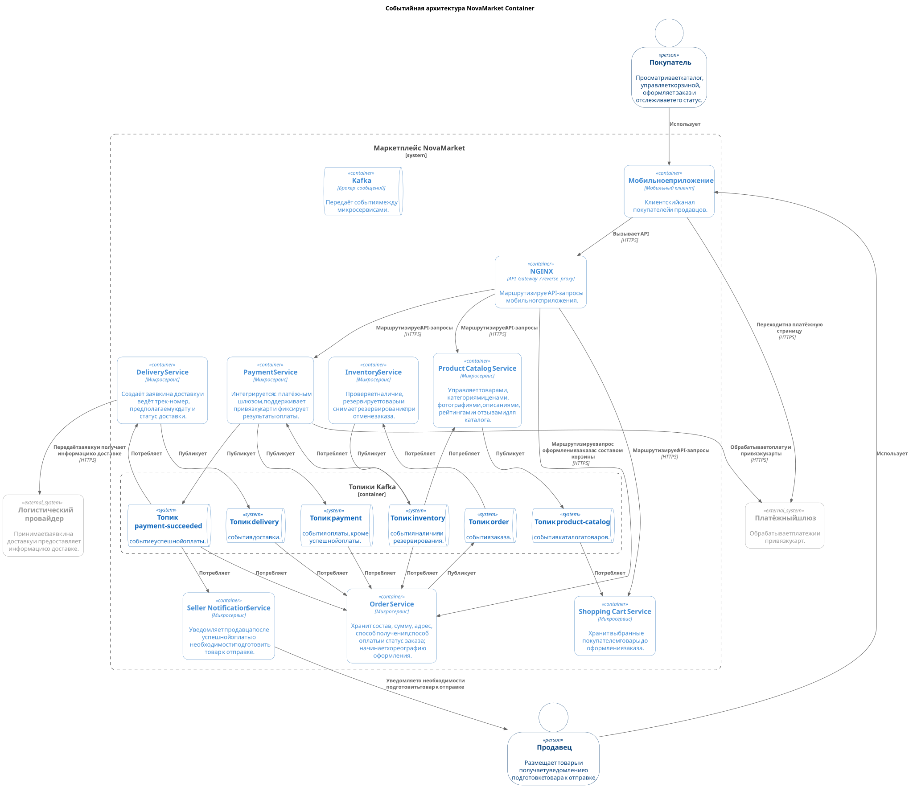
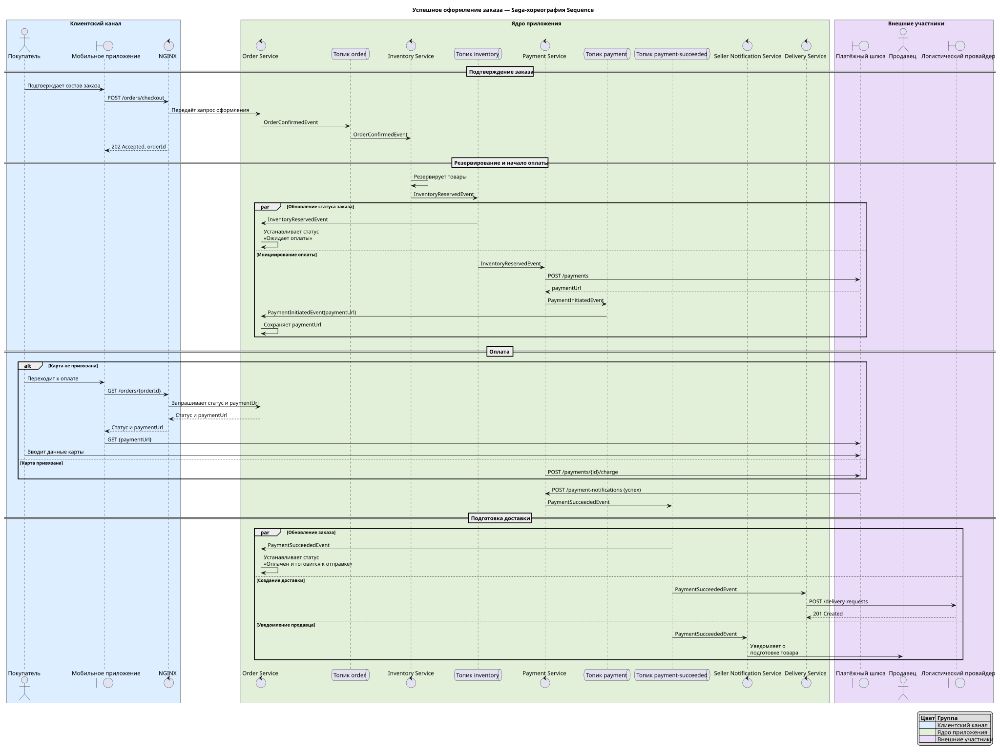
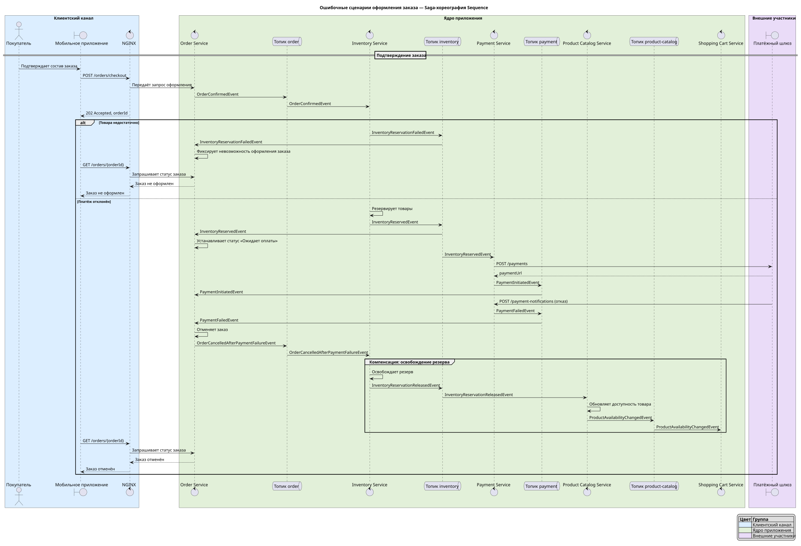

# Спринт 3 Задание 1

- [EDA-Архитектура](#eda-архитектура)
- [События](#события)
- [Сценарий оформления заказа](#сценарий-оформления-заказа)
  - [Диаграммы](#диаграммы)
  - [Реестры событий Saga-хореографии оформления заказа](#реестры-событий-saga-хореографии-оформления-заказа)
    - [Успешный сценарий оформления заказа](#успешный-сценарий-оформления-заказа)
    - [Ошибочные сценарии оформления заказа](#ошибочные-сценарии-оформления-заказа)

---

## EDA-Архитектура

Событийная архитектура NovaMarket Container

## События

- [Реестр событий системы](./all-events-registry.md)

## Сценарий оформления заказа

### Диаграммы

Успешное оформление заказа — Saga-хореография Sequence

Ошибочные сценарии оформления заказа — Saga-хореография Sequence

### Реестры событий Saga-хореографии оформления заказа

В реестры включены события, которые запускают шаг Saga или определяют её результат.

#### Успешный сценарий оформления заказа

| Этап                   | Тип события | Название                 |
| ---------------------- | ----------- | ------------------------ |
| Подтверждение заказа   | domain      | `OrderConfirmedEvent`    |
| Резервирование товаров | domain      | `InventoryReservedEvent` |
| Инициирование оплаты   | domain      | `PaymentInitiatedEvent`  |
| Успешная оплата        | domain      | `PaymentSucceededEvent`  |

#### Ошибочные сценарии оформления заказа

| Этап                                 | Тип события  | Название                                 |
| ------------------------------------ | ------------ | ---------------------------------------- |
| Подтверждение заказа                 | domain       | `OrderConfirmedEvent`                    |
| Недостаток товара при резервировании | failure      | `InventoryReservationFailedEvent`        |
| Резервирование товаров               | domain       | `InventoryReservedEvent`                 |
| Инициирование оплаты                 | domain       | `PaymentInitiatedEvent`                  |
| Ошибка оплаты                        | failure      | `PaymentFailedEvent`                     |
| Отмена заказа после ошибки оплаты    | compensation | `OrderCancelledAfterPaymentFailureEvent` |
| Освобождение резерва                 | domain       | `InventoryReservationReleasedEvent`      |
